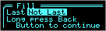

# Minimalist GUI Library

* Button handling with auto-repeat, long-press, virtual buttons
* Popup: menus, forms, messages

Sample GUI from my CookiePortioner project:

Options Menu (`PopupOptionsMenu`):  

Store/Recall Menu (`PopupOptionsMenu`): Shows current value stored in selected cell  

Configuration Menu (`ConfigForm`):  

Individual Values Setting Screen (`ConfigForm` & `FieldEditor`):  

After piston retraction, refill confirmation (`PopupMessage`):  

